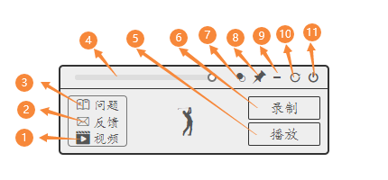
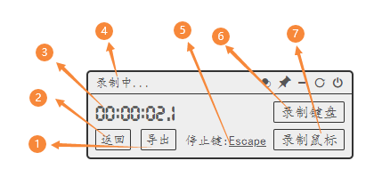
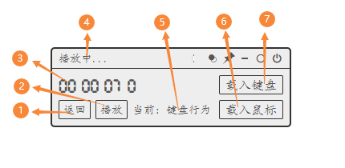

### Introduction

This app is used to record keyboard or mouse events, during which the keyboard or mouse events can be exported as a file with a `toca` suffix. And read this file through the playback function of this app for playback and reproduction.

### Interface

> Home

1. A link jumps to the how-to video.
2. Send me suggestions/comments using mail.
3. Raise an issue on GitHub.
4. A draggable bar to set the transparency of the app window.
5. Enter the `Playback` sub-interface.
6. Enter the `Record` sub-interface.
7. One button click to show/hide the transparency adjustment bar.
8. A switch to toggle whether the window is always-on-top.
9. `Minimize` button.
10. `Reload` button.
11. `Exit` button.

> Record

1. A button click to export recorded events as files with `toca` suffix.
2. Back to the `Home` interface.
3. Duration of recording.
4. This will show `录制中...` if recording is in progress.
5. Customizable trigger key to stop recording. (default to `Escape`)
6. Click to start recording `keyboard` events.
7. Click to start recording `mouse` events.

> Playback

1. Back to the `Home` interface.
2. Click to start playing the currently loaded event file.
3. The remaining time of the currently loaded event file.
4. This will show `播放中...` if playing is in progress.
5. Displays whether `keyboard` or `mouse` events are currently playing.
6. Select and load a mouse events file. (extended with `.m.toca`)
7. Select and load a keyboard events file. (extended with `.k.toca`)